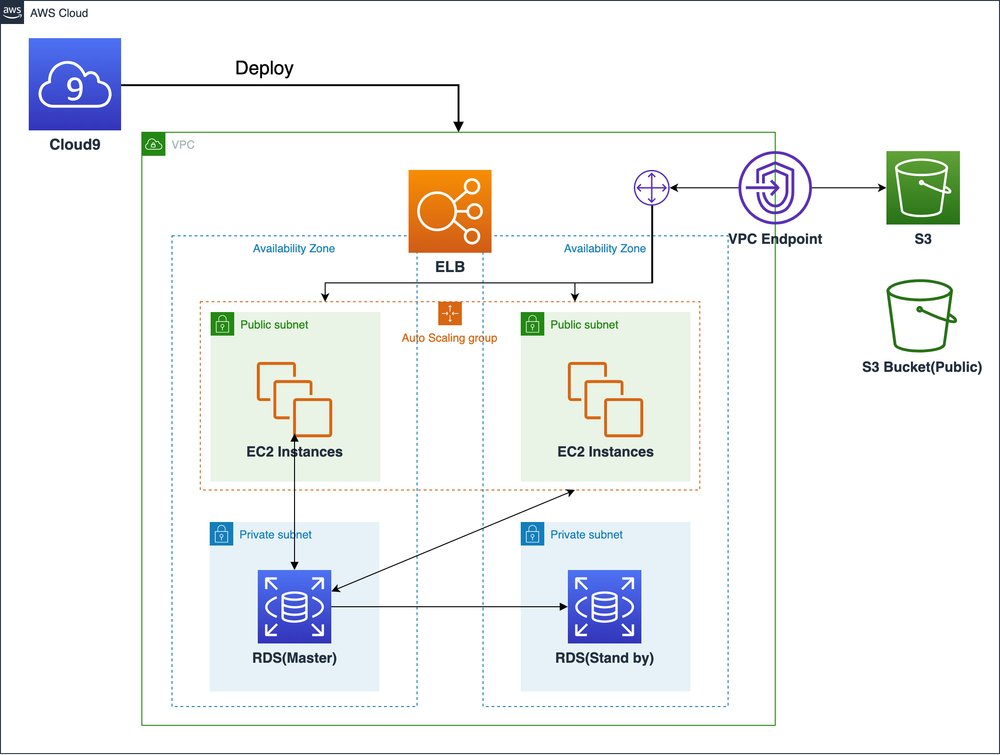

# Welcome to build up LAMP architecture by CDK with Typescript

The AWS Cloud Development Kit (AWS CDK) is an open-source software development framework to define cloud infrastructure in code and provision it through AWS CloudFormation.

It offers a high-level object-oriented abstraction to define AWS resources imperatively using the power of modern programming languages. Using the CDK’s library of infrastructure constructs, you can easily encapsulate AWS best practices in your infrastructure definition and share it without worrying about boilerplate logic.

Developers use the [CDK framework](https://docs.aws.amazon.com/cdk/latest/guide/home.html) in one of the supported programming languages to define reusable cloud components called [constructs](https://docs.aws.amazon.com/cdk/latest/guide/constructs.html), which are composed together into [stacks](https://docs.aws.amazon.com/cdk/latest/guide/stacks.html), forming a "CDK app".

They then use the AWS CDK CLI to interact with their CDK app. The CLI allows developers to synthesize artifacts such as AWS CloudFormation Templates, deploy stacks to development AWS accounts and "diff" against a deployed stack to understand the impact of a code change.

By the end of this lab, you will be able to:

* What is difference between imperative infrastructure and declarative infrastructure?
* What is the benefit of developing with AWS CDK?
* Why LAMP structure?

## Scenario
In view of building up complex web applications from scratch is a time-consuming process. PHP frameworks such as Laravel and Symfony provide a structured and standardized way to build web applications. Defining these resources with the AWS CDK construct library allows developers to apply the same framework principles to infrastructure as code.

In this lab, We would leverage AWS CDK enables fast and easy onboarding for new developers. In addition to improved readability through reduced codebase size, PHP developers can use their existing skills and tools to build cloud infrastructure. Familiar concepts such as objects, loops, and conditions help to reduce cognitive overhead. Defining the LAMP stack infrastructure for your PHP application within the same codebase reduces context switching and streamlines the provisioning process. Connect CDK constructs to deploy a serverless LAMP infrastructure quickly with minimal code.

## Useful commands

 * `npm run build`   compile typescript to js
 * `npm run watch`   watch for changes and compile
 * `npm run test`    perform the jest unit tests
 * `cdk deploy`      deploy this stack to your default AWS account/region
 * `cdk diff`        compare deployed stack with current state
 * `cdk synth`       emits the synthesized CloudFormation template
